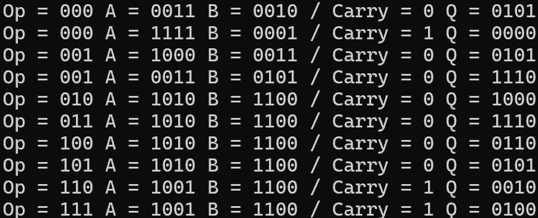
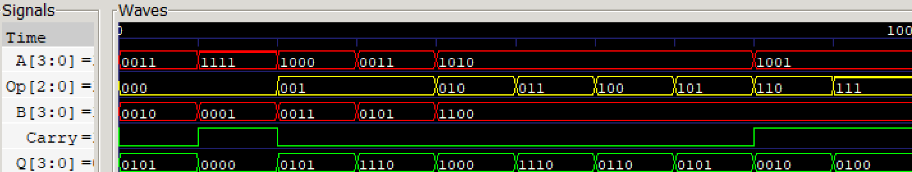

# 4-bit Arithmetic Logic Unit
Verilog HDL을 활용하여 4-bit Arithmetic Logic Unit (ALU)을 설계한 프로젝트입니다

3-bit Opcode 신호에 따라 산술 연산(ADD, SUB) 및 논리 연산(AND, OR, XOR, NOT), 시프트 연산(Shift Left, Shift Right)을 수행하고 Carry 및 4-bit 결과 값을 출력하도록 구현하였습니다

## 📖 Simulation
### CMD

### Waveform

## 🛠 Development Environment
- Language : Verilog HDL
- Editor : Antigravity IDE (VS Code)
- Tool : Icarus Verilog + GTKWave
