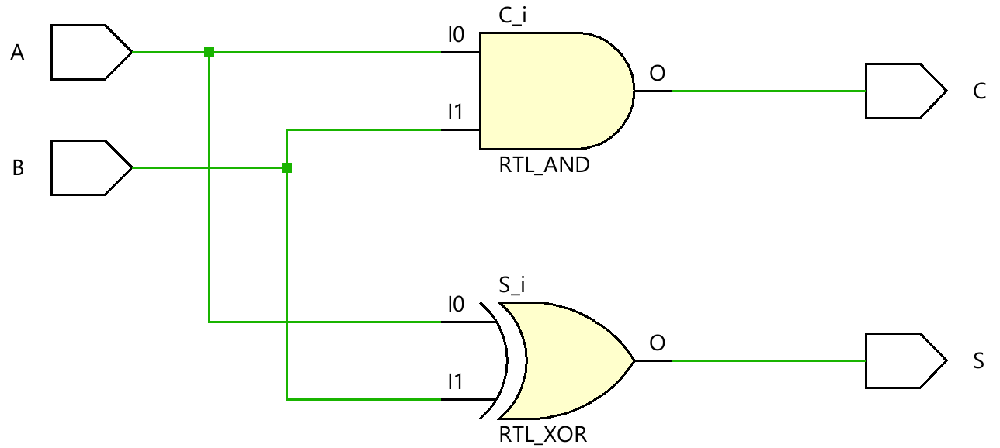
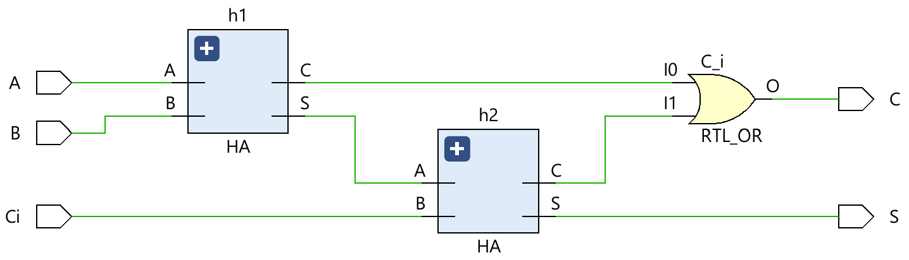
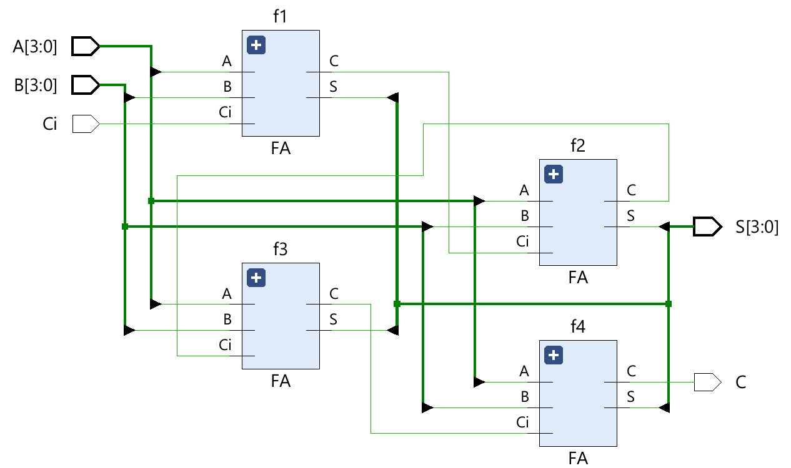
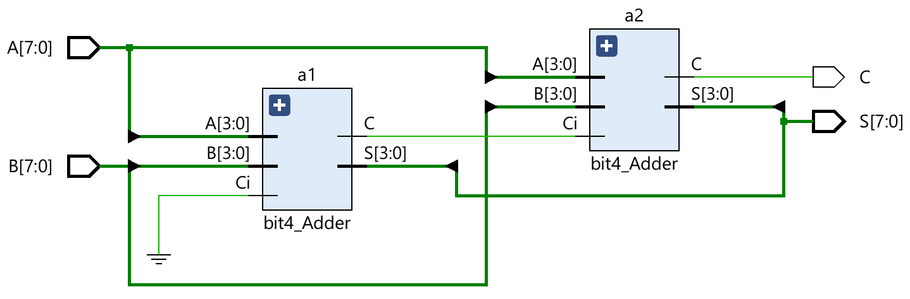

# 8-bit Ripple Carry Adder
Verilog HDL을 활용하여 8-bit Ripple Carry Adder을 설계한 프로젝트입니다.

Half Adder(HA), Full Adder(FA), 4-bit Adder를 계층적으로 설계하여 최종적으로 8-bit Adder를 구현하였습니다.

## 🏗 Module Hierarchy
```text
bit8_Adder
├── bit4_Adder
│   ├── Full Adder
│   │   ├── Half Adder
│   │   └── Half Adder
│   └── ...
└── bit4_Adder
```

## 📖 Schematic
- Half Adder


- Full Adder


- 4-bit Adder


- 8-bit Adder


## 💻 Simulation
- Editor : Antigravity IDE
- Tool : Vivado 2023.2
