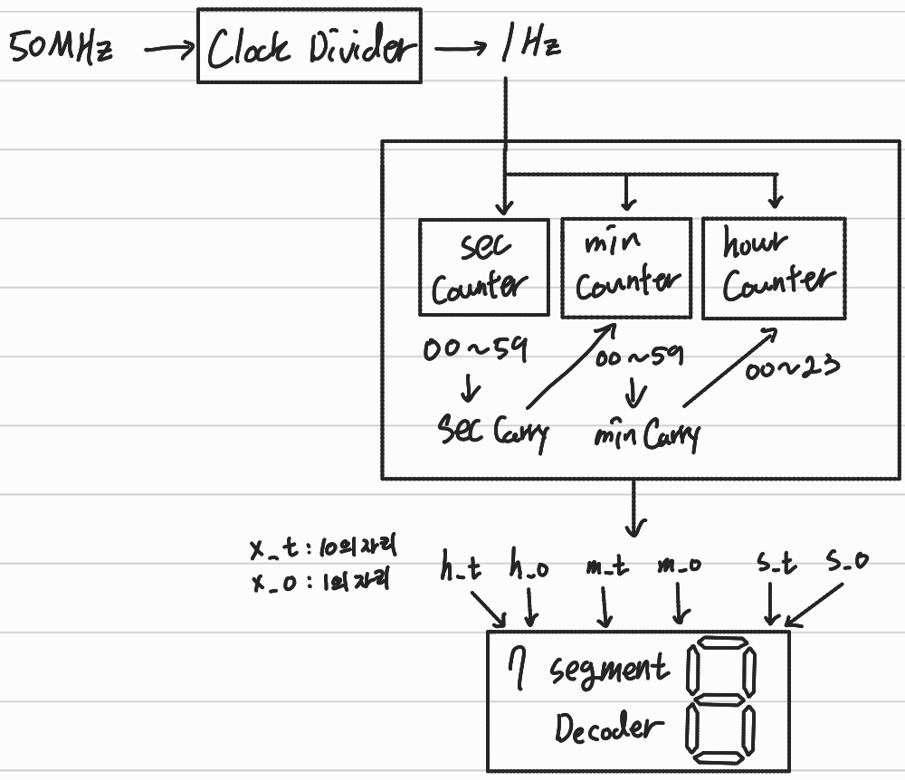
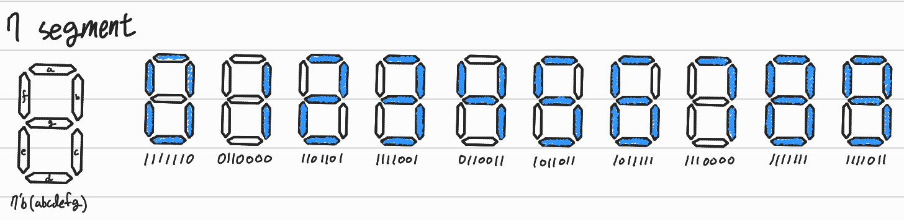
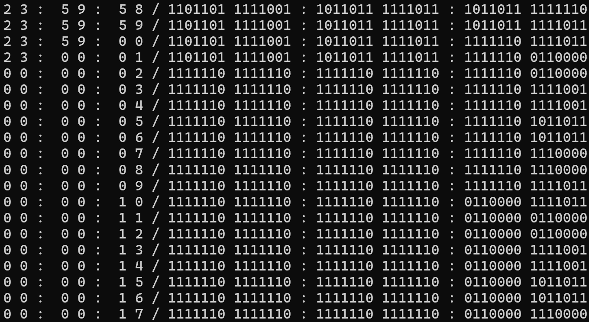
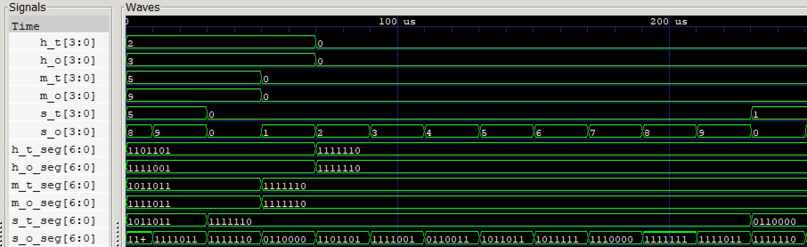

# Digital Clock
Verilog HDL을 활용하여 7-Segment Display 기반의 Digital Clock을 설계한 프로젝트입니다.

50MHz 기본 클록을 1Hz 신호로 분주하는 Clock Divider, 초·분·시 단위 카운터, 그리고 각 자릿수(시, 분, 초의 10의 자리 및 1의 자리)를 7-Segment에 표시하기 위한 Decoder 모듈을 계층적으로 구동하도록 구현하였습니다.

## 📝 Module Hierarchy
```text
Digital_Clock
├── clock_divider
├── sec_counter
├── min_counter
├── hour_counter
└── Seven_Segment (x6)
```

## 📖 Schematic
### Block Diagram


### 7-Segment


## 📈 Simulation
### CMD


### Waveform


## 🛠 Development Environment
- Language : Verilog HDL
- Editor : Antigravity IDE (VS Code)
- Tool : Icarus Verilog + GTKWave
