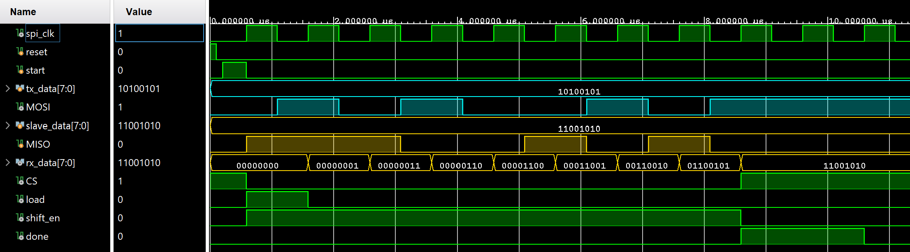

# Serial Peripheral Interface
Verilog HDL을 활용하여 Serial Peripheral Interface(SPI)를 설계한 프로젝트입니다.

SPI Master와 SPI Slave를 계층적으로 설계하여 MOSI, MISO, SCLK, CS 신호를 이용한 8-bit 직렬 데이터 송수신 기능을 구현하였습니다.

## 📝 Module Hierarchy
```text
SPI
├── SPI_Master
│   └── ...
└── SPI_Slave
    └── ...
```

## 📖 Schematic
### SPI Master


## 📈 Waveform
### SPI Master


## 🛠 Development Environment
- Language : Verilog HDL
- Editor : Antigravity IDE (VS Code)
- Tool : Vivado 2024.2
