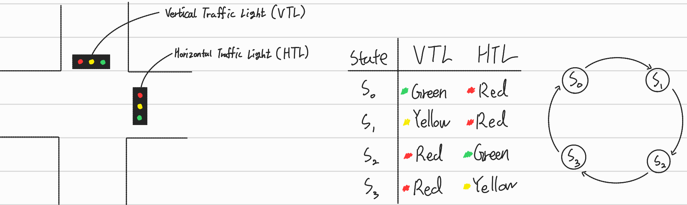
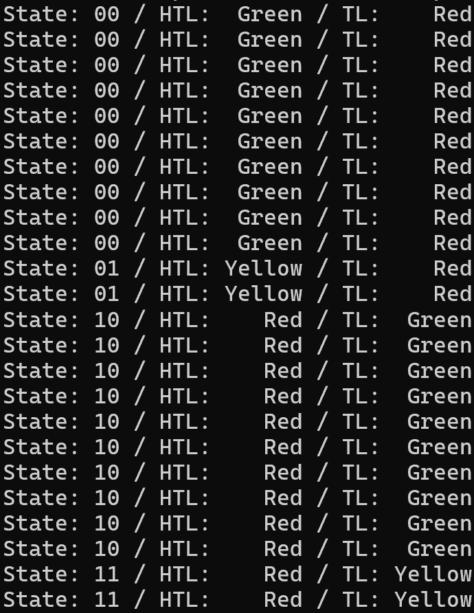
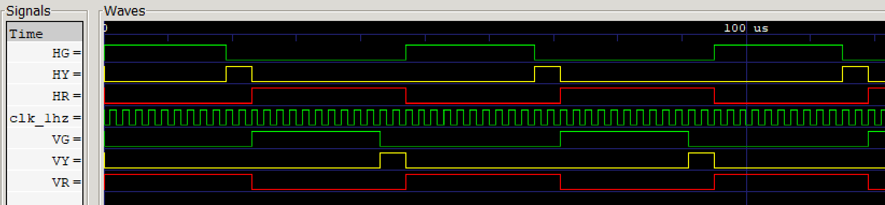

# Traffic Light Controller
Verilog HDL을 활용하여 FSM 기반의 Traffic Light Controller를 설계한 프로젝트입니다.

50MHz 기본 클록을 1Hz 신호로 분주하는 Clock Divider와, 상태 변화에 따라 수평/수직 방향 신호등(Green, Yellow, Red)의 LED 출력을 제어하는 FSM(Finite State Machine) 모듈을 계층적으로 구동하도록 구현하였습니다.

## 📝 Module Hierarchy
```text
Traffic_Light
├── clock_divider
└── Traffic_fsm
```

## 📖 Schematic
### FSM


## 📈 Simulation
### CMD


### Waveform


## 🛠 Development Environment
- Language : Verilog HDL
- Editor : Antigravity IDE (VS Code)
- Tool : Icarus Verilog + GTKWave
