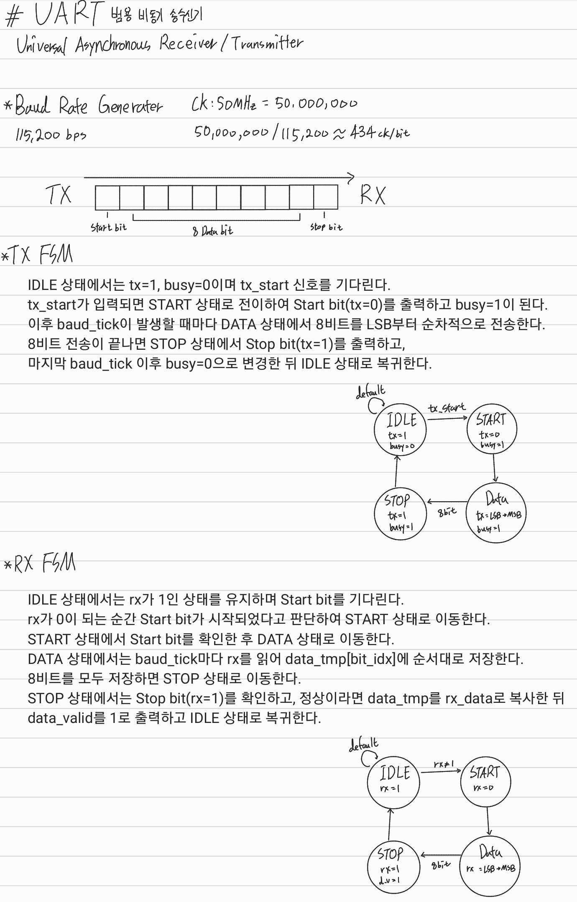
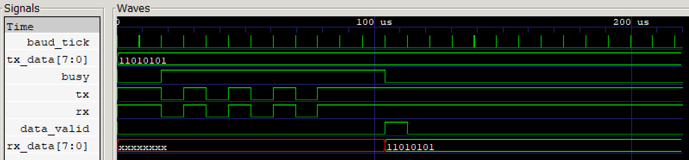

# Universal Asynchronous Receiver/Transmitter
Verilog HDL을 활용하여 Universal Asynchronous Receiver/Transmitter (UART)를 설계한 프로젝트입니다.

Baud Rate Generator를 통해 115,200 bps 보드레이트에 맞춘 `baud_tick` 신호를 생성하고, TX 모듈과 RX 모듈을 FSM 기반으로 독립 제어하여 8-bit 비동기 직렬 데이터 송수신 기능을 구현하였습니다.

## 📝 Module Hierarchy
```text
UART
├── Baud_Rate_Generator
├── UART_TX
└── UART_RX
```

## 📖 Schematic
### FSM


## 📈 Waveform
### UART


## 🛠 Development Environment
- Language : Verilog HDL
- Editor : Antigravity IDE (VS Code)
- Tool : Icarus Verilog + GTKWave
