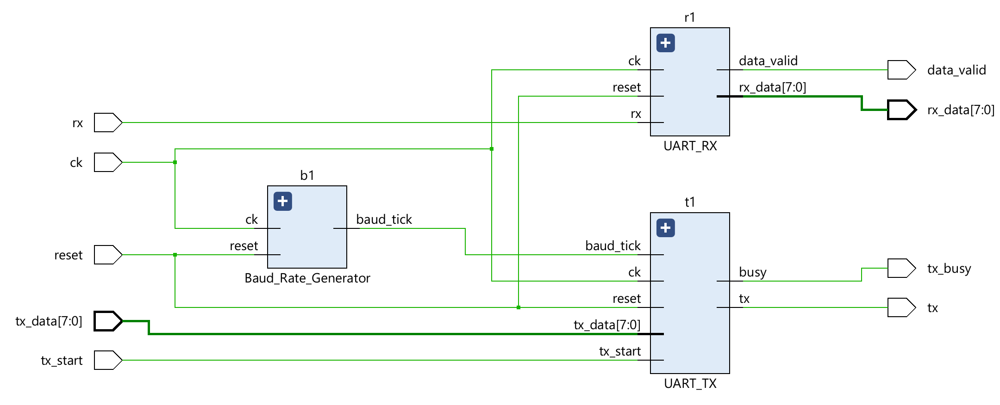
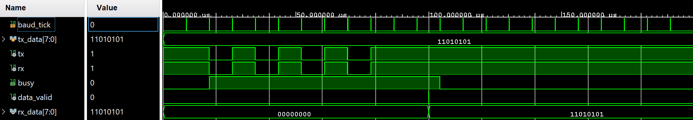

# Universal Asynchronous Receiver/Transmitter with Mid-Bit Sampling
Verilog HDL을 활용하여 Universal Asynchronous Receiver/Transmitter (UART)를 설계한 프로젝트입니다.

비동기 통신 시 수신 신호의 노이즈 및 타이밍 오차로 인한 데이터 오작동을 방지하기 위해, 각 비트 전송 구간의 중앙(Mid-bit) 시점에서 데이터 샘플링을 수행하도록 이전 UART 모듈에서 RX FSM을 개선하여 수신 신뢰성을 높였습니다.

## 📝 Module Hierarchy
```text
UART
├── Baud_Rate_Generator
├── UART_TX
└── UART_RX (Mid-bit Sampling)
```

## 📖 Schematic
### UART


## 📈 Waveform
### UART with Mid-Bit Sampling


## 🛠 Development Environment
- Language : Verilog HDL
- Editor : Antigravity IDE (VS Code)
- Tool : Vivado 2024.2
